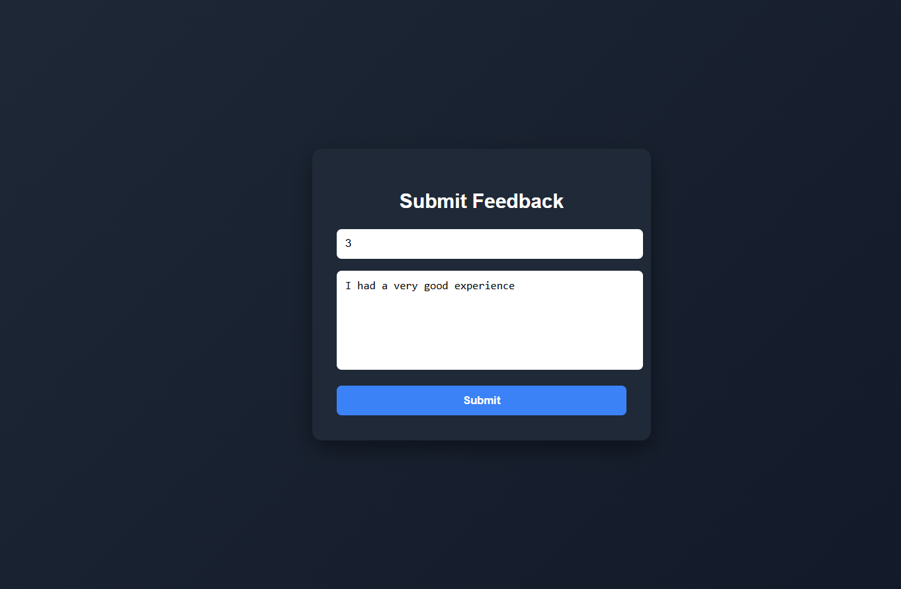
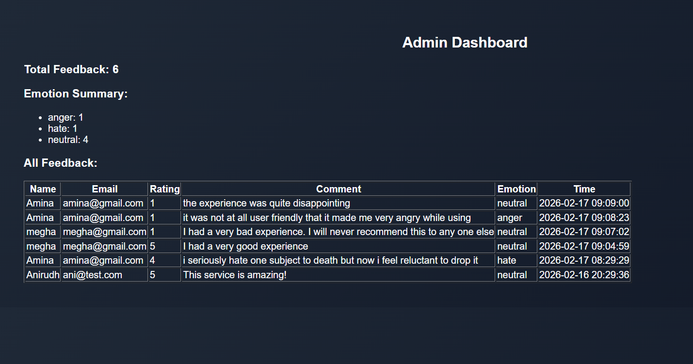

# AI + React Emotion Feedback System

## Overview

This project is a full-stack web application developed as part of an AI + React screening assessment.

The system allows users to submit platform feedback, automatically detects the emotional sentiment of the feedback using a Machine Learning model, and provides an administrative dashboard to analyze user responses.

---

## Screenshots

### Login Page


### Signup Page


### Feedback Page


### Admin Dashboard


---

## Tech Stack

### Frontend
- React.js
- Axios
- React Router DOM

### Backend
- Flask (Python)
- SQLite Database

### Machine Learning
- TF-IDF Vectorization
- Logistic Regression
- Scikit-learn


## How to Run the Application

### Prerequisites

- Python 3.9+
- Node.js 16+
- pip
- npm

---

## How to Run the Application

### Prerequisites
- Python 3.9+
- Node.js 16+
- pip
- npm

---

### Backend Setup

```bash
cd backend
pip install -r requirements.txt
python backend.py
```

Backend runs at:

```
http://127.0.0.1:5000
```

### Frontend Setup

```bash
cd frontend
npm install
npm start
```

Frontend runs at:

```
http://localhost:3000
```

### Admin Credentials

```
Username: admin
Password: admin123
```